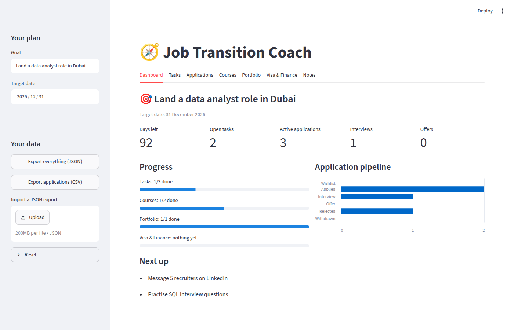
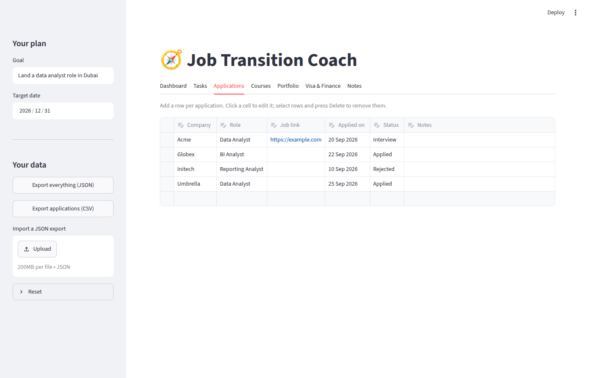

# 🧭 Job Transition Coach

[](https://github.com/amitrayamajhi/job-transition-coach/actions/workflows/ci.yml)


[](LICENSE)

A simple planner for changing jobs. Set a goal and a deadline, track your
applications from *Applied* to *Offer*, and keep your to-dos, courses,
portfolio pieces and visa/finance prep in one place.

<!-- Replace with your Streamlit Community Cloud link once deployed (see "Deploy" below) -->
**Live demo:** _coming soon_



## Features

- **Goal and countdown.** Set what you're aiming for and a target date. The
  dashboard shows the days left.
- **Application pipeline.** A spreadsheet-style table with company, role, job
  link, date applied, status (Wishlist → Applied → Interview → Offer / Rejected /
  Withdrawn) and notes, plus a chart of where everything stands.
- **Checklists** for tasks, courses, portfolio and visa & finance, each with a
  progress bar.
- **Dashboard** with open tasks, active applications, interviews, offers and
  what to do next.
- **Notes** for interview prep, contacts and salary research.
- **Your data stays yours.** It's saved to a local JSON file. Export everything
  as JSON (or your applications as CSV) and import it back at any time.



## Run it locally

Requires Python 3.10 or newer.

```bash
git clone https://github.com/amitrayamajhi/job-transition-coach.git
cd job-transition-coach
pip install -r requirements.txt
streamlit run app.py
```

The app opens at <http://localhost:8501>. Your data is saved to
`job_coach_data.json` next to `app.py`. It's listed in `.gitignore`, so it's
never committed.

### Configuration

| Environment variable  | Default                          | What it does                                                          |
| --------------------- | -------------------------------- | --------------------------------------------------------------------- |
| `JOB_COACH_DATA_FILE` | `job_coach_data.json` by `app.py` | Where to save your data.                                              |
| `JOB_COACH_DEMO`      | off                              | Set to `1` to keep data only in the browser session (for public demos). |

## Deploy (free) on Streamlit Community Cloud

1. Sign in at [share.streamlit.io](https://share.streamlit.io) with GitHub.
2. **Create app** → pick this repo, branch `main`, main file `app.py`.
3. Under **Advanced settings → Secrets**, add:

   ```toml
   JOB_COACH_DEMO = "1"
   ```

   This matters: without it, everyone using your public link would share one
   data file and see each other's entries.
4. Deploy, then paste the URL into the **Live demo** line above and into the
   repo's *About* box on GitHub.

## Development

```bash
pip install -r requirements-dev.txt
pytest            # run the tests
ruff check .      # lint
ruff format .     # format
```

GitHub Actions runs the same checks on every push.

### Project layout

```
app.py                 Streamlit user interface
job_coach/storage.py   Data model, load/save, import/export, stats (no Streamlit, fully tested)
tests/                 pytest tests
docs/                  Screenshots used in this README
```

Data files from the first version of the app load automatically and are
upgraded to the new format.

## Roadmap

- Follow-up reminders for applications with no reply after N days
- Weekly goals (e.g. "apply to 5 jobs this week") with streaks
- Optional cloud storage so data syncs across devices

## License

[MIT](LICENSE) © Amit Rayamajhi
